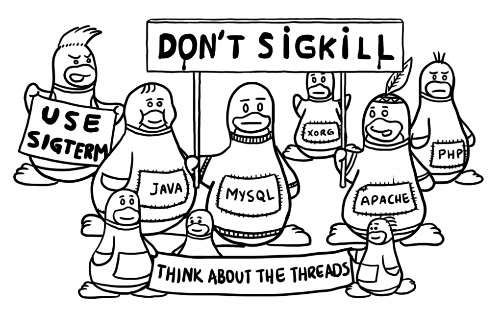
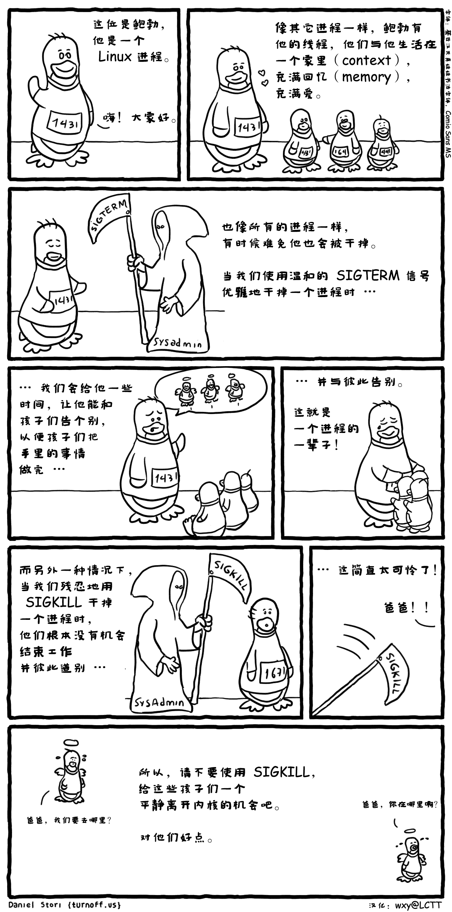

### kill 指令

​	

| 信号编号 | 信号名     | 说明                                                         |
| -------- | ---------- | ------------------------------------------------------------ |
| 0        | EXIT       | 程序退出时收到该信息                                         |
| 1        | HUP        | 挂掉电话线或终端连接的挂起信号，这个信号也会造成某些进程在没有终止的情况下重新初始化。 |
| 2        | ***INT***  | 表示结束进程，但并不是强制性的，常用的 "Ctrl+C" 组合键发出就是一个 kill -2 的信号。 |
| 3        | ***QUIT*** | 退出。常用的 "Ctrl+\" 组合键发出就是一个 kill -2 的信号,进程在因收到SIGQUIT退出时会产生core文件, 在这个意义上类似于一个程序错误信号 |
| 9        | ***KILL*** | 杀死进程，即强制结束进程。                                   |
| 11       | SEGV       | 段错误                                                       |
| 15       | ***TERM*** | ***正常结束进程，是 kill 命令的默认信号。通常用来要求程序自己正常退出。如果进程终止不了，我们才会尝试SIGKILL*** |

