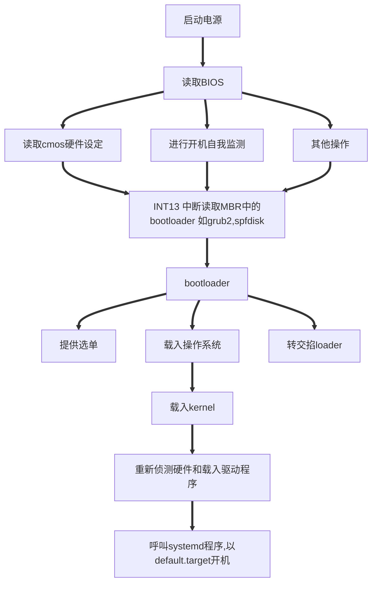

```mermaid
graph TB
start-engine[启动电源]==> read-bios[读取BIOS]
read-bios==>read-cmos[读取cmos硬件设定]
read-bios==>check[进行开机自我监测]
read-bios==>other[其他操作]
read-cmos ==> int13[INT13 中断读取MBR中的bootloader 如grub2,spfdisk]
check ==> int13[INT13 中断读取MBR中的bootloader 如grub2,spfdisk]
other ==> int13[INT13 中断读取MBR中的bootloader 如grub2,spfdisk]
int13 ==> bootloader[bootloader]
bootloader ==> choose-os[提供选单]
bootloader ==> load-os[载入操作系统]
bootloader ==> route-other[转交掐loader]
load-os ==> load-kernel[载入kernel]
load-kernel ==> check-os[重新侦测硬件和载入驱动程序]
check-os ==> call-systemd[呼叫systemd程序,以default.target开机]


```

