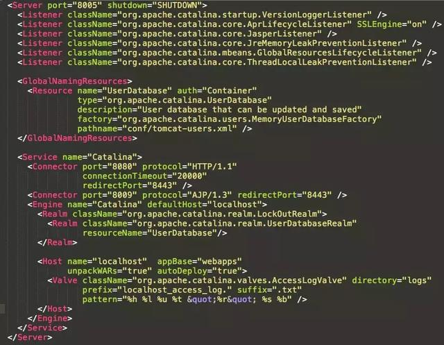
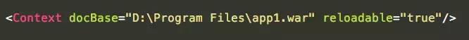
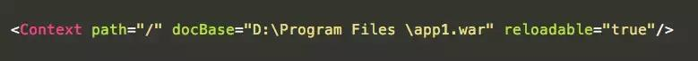

- ***tomcat结构***

  ```mermaid
  graph TB
  startup(start)-->server[Server]
  server-->service1[Service1]
  server-->service2[Service2]
  server-->service3[Service3]
  service1-->connector1[Connector1]
  service1-->connector2[Connector2]
  service1-->connector3[Connector3]
  service1-->engine[Engine]
  connector1-->engine
  connector2-->engine
  connector3-->engine
  engine-->host1[Host1]
  engine-->host2[Host2]
  engine-->host3[Host3]
  host1-->context1[Context1]
  host1-->context2[Context2]
  host1-->context3[Context3]
  
  ```



- ***server.xml详细说明***
  
  - server是整个配置文件的根元素，shutdown属性表示关闭server的指令，port属性表示server接收shutdown指令的端口，通过telnet可以关掉server。将port设置为-1可以禁用掉接收shutdown的端口
  - service元素代表一个Engine元素以及一组与之相连的Connector元素
  - connector代表了外部客户端发送请求到指定service接口，接收连接请求，创建request和response对象用于和请求端交换数据，然后分配Engine来处理请求，并把request和response对象传给engine
  - Engine处理service中的所有请求，connector从客户端接收请求，Engine处理接收进来的请求
  - 一个Host组件可以处理发向特定虚拟主机的所有请求
    - ***deployOnStartup***为true时，Tomcat在启动时检查Web应用，且检测到的所有Web应用视作新应用
    - ***autoDeploy***为true时，Tomcat在运行时定期检查新的Web应用或Web应用的更新
    -  ***appBase***属性指定Web应用所在的目录，默认值是webapps 
    -  xmlBase属性指定Web应用的XML配置文件所在的目录，默认值为conf/<engine_name>/<host_name> 
  - 一个Context组件可以处理一个特定Web应用的所有请求
    - docBase制定了Web应用所使用的WAR包路径，***在自动部署场景下，docBase不在appBase目录中，才需要指定***；如果docBase指定的WAR包或者应用目录在docBase中，则不需要指定，因为tomcat会自动扫描appBase中的WAR包和应用目录，制定了反而会造成问题
    
    - path制定了访问该Web应用的上下文路径，当请求到来时，Tomcat根据web应用的path属性与URI的匹配程度来选择web应用处理相应请求。***在自动部署场景下，不能指定path属性***，path属性由配置文件的文件名，WAR文件的文件名或者应用目录的名称自动推导出来。
    
    - reloadable属性指示tomcat是否在运行时监控在WEB-INF/classes和WEB-INF/lib目录下class文件的改动。如果值为true，那么当class文件改动时，会触发Web应用的重新加载 , ***在开发环境下，reloadable设置为true便于调试；但是在生产环境中设置为true会给服务器带来性能压力，因此reloadable参数的默认值为false***。 
    
    - 自动部署配置
      
    
    - 静态部署配置
    
      
    
    - ***推荐使用动态自动部署***
    
      在静态部署的时候，docBase可以在appBase目录下，也可以不在；
    
      ***但是只有当自动部署完全关闭(deployOnStartup和autoDeploy都为false)或docBase不在appBase下时，才可以设置path***
    

- ***其他组件***

  - **Listener**

     Listener(即监听器)定义的组件，可以在特定事件发生时执行特定的操作；被监听的事件通常是Tomcat的启动和停止。  监听器可以在Server、Engine、Host或Context中 。

     监听器需要配置的最重要的属性是className，该属性规定了监听器的具体实现类，该类必须实现了org.apache.catalina.LifecycleListener接口。 

  - **GlobalNamingResources与Realm**
  
      Realm，可以把它理解成“域”；Realm提供了一种用户密码与web应用的映射关系，从而达到角色安全管理的作用 
  
  - **Value**
  
      单词Valve的意思是“阀门”，在Tomcat中代表了请求处理流水线上的一个组件；Valve可以与Tomcat的容器(Engine、Host或Context)关联。 
  
      AccessLogValve的作用是通过日志记录其所在的容器中处理的所有请求，在本例中，Valve放在Host下，便可以记录该Host处理的所有请求 