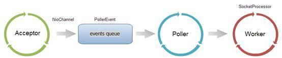

- ***TOMCAT***

  - **tomcat connector工作流程**

    ​	在部署tomcat的时候，经常会涉及到***连接数***与***线程数***之类的配置问题，要理解这些概念，需要了解Tomcat的连接器,tomcat连接器功能如下：

    1. 接收客户端连接请求
    2. 创建Request和Response对象
    3. 分配线程让Engine(Servlet容器)来处理请求，并把产生的Request和Response对象传给Engine
    4. Engine处理完请求之后，也会通过Connector将响应返回给客户端。

  - **tomcat connector protocol **

    - *指定protocol*

      ​	connector在处理http请求的时候，会使用不同的protocol，不同的tomcat版本支持的protocol不同，其中最典型的协议包括：*BIO*、*NIO*、*APR*，（tomcat7中支持上述三种协议，tomcat8增加了对NIO2的支持，而到了tomcat8.5和tomcat9.0，则去掉了BIO），可以通过指定protocol来使用对应的协议，如果没有指定protocol，则使用默认值HTTP/1.1，在tomcat7中，自动选取使用BIO或者APR（如果找到APR需要的本地库则使用APR，否则使用BIO）；tomacat8 中，自动选取使用NIO和APR（如果找到APR需要的本地库，则使用APR，否则使用NIO）

      1. BIO

         Blocking IO，阻塞IO

          org.apache.coyote.http11.Http11Protocol 

      1. NIO

         Non-blocking IO，非阻塞IO

          org.apache.coyote.http11.Http11NioProtocol 

      3. ARP

         Apache Protable Runtime

         org.apache.coyote.http11.Http11AprProtocol 

         是Apache可移植运行库，利用本地库可以实现高可扩展性、高性能，ARP是Tomcat上运行高并发应用的首选模式，但是需要安装APR、APR-UTILS、TOMCAT-NATIVE等包。

    - *protocol 工作模式*

      

      - 处理流程
        1. 客户端向服务器发送请求，并且客户端与OS完成三次握手，则OS将该链接放入Acceptor队列
        2. 在连接中获取请求的数据，生成request
        3. 调用servlet容器处理请求，返回response
      - BIO与NIO异同
        - BIO实现的connector中，处理请求的主体是JioEndPoint对象，JioEndPoint维护了Acceptor和Worker：Acceptor接收socket，然后从worker线程池中找到空闲的线程处理socket，如果worker中没有空闲线程，则***Acceptor将阻塞***。其中Worker是tomcat自带的线程池，可以自己配置线程池
        - NIO实现的connector中，处理请求的主要实体是NioEndPoint对象。NioEndPoint除了包含Acceptor和Worker外，还用到了Poller，处理流程如上图；Acceptor接收socket后，并不是直接使用worker中的线程处理请求，而是先将请求发送给Poller，而Poller是实现NIO的关键。Acceptor向Poller发送请求通过队列实现，是典型的***生产者-消费者模式***。在Poller中维护了selector对象，当poller从队列中取出socket后，注册到该selector中，然后通过遍历selector，找到其中可读的socket，并使用worker中的线程处理相应请求。与BIO类似，worker也可以被自定义的线程池代替。
        - 在NioEndPoint处理请求的过程中，***无论是Acceptor接收socket还是线程处理请求，使用的仍然是阻塞方式，但是在读取socket并交给worker中的线程这个过程中，使用非阻塞NIO实现，这是NIO和BIO的主要区别***，而这个区别在并发量较大的情形下可以带来tomcat效率显著提升

  - **几个重要参数**

    ​	tomcat处理请求的过程中，在accept队列中接收连接；在链接中获取请求的数据，生成resquest；调用servlet容器处理请求；返回response

    - *acceptCount*

      ​	accept队列的长度；当accept队列中连接达到acceptCount时，队列满，进来的请求一律被拒绝，默认是100

    - *maxConnections*

      ​	tomcat在任意时刻接收和处理的最大连接数。当tomcat接收的连接数达到maxConnections时，Acceptor线程不会读取accept队列中的连接；这时accept队列中的线程会一直阻塞，直到tomcat接收的连接数小于maxConnections。如果设置为-1，则连接数不受限制。

      ​	maxConnections与连接器使用的协议有关，NIO默认是10000，ARP/native默认值是8192，而BIO的默认值是maxThreads（如果配置了Executor，则默认值是Executor的maxThreads）

      ​	在windows下，APR/native的maxConnections值会自动调整为设置值一下最大的1024的倍数；如果设置为2000，则最大实际值为1024

    - *maxThreads*

      ​	请求处理线程的最大数量，默认是200（tomcat7 和 8都是的）。如果该Connector绑定了Executor，这个值会被忽略，转而使用自定义的Connector绑定的Executor。maxThreads规定的是最大的线程数量，并不是实际running的cpu数量；实际上maxThreads的大小比cpu核心数量要大得多。这是因为处理请求的线程真正用于计算的时间可能很少，大部分时间可能在阻塞，如等待数据库返回数据，等待磁盘读写数据，因此，在某一时刻，只有少数的线程真正的在使用物理cpu，大多数线程都在等待；因此线程数远大于物理核心数才是合理的。换句话说，tomcat通过使用比cpu数量多得多的线程数，可以使cpu忙碌起来，大大提高cpu利用率，但是maxThreads并不是越大越好，如果maxThreads过大，那么cpu会花费大量的时间用于线程的切换，整体效率会降低

  - **查看系统状态**

    1. 使用jconsole,jvisualvm等工具

    2. 使用linux自身工具

       1. 查看连接数

          ```shell
           netstat –nat | grep 8083 
          ```

       2. 查看进程的线程数目

          ```shell
          #获取进程ID
          ps –e | grep java
          
          #获取进程中的线程数
          ps –o nlwp 27989
          ```

- ***NIO***

  ***NIO主要解决的问题是使用一个线程管理多个IO连接***

  - **传统BIO**

    1. 一个线程处理一个请求，每个线程阻塞的处理IO
    2. 使用线程池，同样是一个线程处理一个请求，每个线程阻塞处理IO

    

    ​		

  - **NIO**

    nio主要由以下几个部分组成:Channel(通道)、Buffer(缓冲区)、Selector(选择器)

    1. channel提供从文件、网络读取数据的通道，但是读取或者写入的数据都必须经由buffer，通道是双向的，通过一个channel既可以提供读，也可以进行写
    2. Buffer，顾名思义，缓冲区，实际提供了一个容器——连续数组，服务端接收数据必须通过Channel将数据读入Buffer，然后再从Buffer中取出数据来处理
    3. Selector是NIO的核心，selector能够检测多个注册的通道上是否有事件发生，如果有事件发生，便获取事件然后针对每个事件进行相应的相应处理

    三个组件的关系类似如下：

    

    

    其中，一个线程管理一个selector，而一个selector管理多个channel，被管理的channel需要在该selector上注册自己感兴趣的事件，如Accept，Read，Write等，每个channel对应一个缓冲区Buffer，每次channel中有数据可以读写的时候，就读写到缓冲区，然后程序再对缓冲区进行操作，这样只用一个单线程就可以管理多个通道，也就是多个连接。只有在连接真正有读写事件发生时，才会调用相应的方法或者线程来进行读写操作，大大减少系统开销。